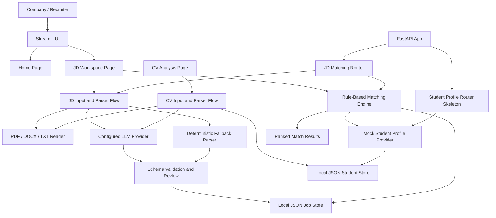

# Architecture

## Selected Level

Level 3 - Demo Day.

## System Overview



## Backend Shape

The backend uses one FastAPI app that composes agent-style routers.

```text
backend/src/
  api/
    main.py              FastAPI app composition
    agents/
    jd_matching/         JD parsing, job management, matching routes
    cv_analysis/         CV parsing and student profile storage routes
    student_profile/     Small student profile API skeleton
  core/                  settings and paths
  models/                shared dataclasses and validation helpers
  provider/              shared LLM provider adapters
  services/              shared parser, storage, document reader, matching logic
  core/auth.py           demo role-based authorization helpers
```

This keeps the current demo simple while still giving each future task a clear place to live.

## AI Core

The AI core is the JD parser. It extracts structured job requirements from uploaded or manually entered JD content. Matching decisions are deterministic and are not made by the LLM.

If the selected LLM provider is not configured or fails, the system uses a deterministic fallback parser so the demo remains usable.

## Agents / Modules

| Name | Responsibility |
|------|----------------|
| `jd_matching` | Parse JD, save and manage jobs, run matching for open jobs. |
| `cv_analysis` | Parse CV uploads/text into student skill profiles and save local student JSON. |
| `student_profile` | Skeleton API for student profile summaries and future integration. |
| Document reader | Extract text from PDF, DOCX, or TXT uploads. |
| Schema validator | Check required fields, data types, score ranges, and skill requirements. |
| Matching engine | Rank students for one open job using deterministic rules. |
| Student profile provider | Return mock student profiles now; can be replaced by an API provider later. |
| Demo auth | Enforce basic `student` and `enterprise` role boundaries through request headers. |
| YouTube RAG pipeline | Crawl video or playlist transcripts, clean captions, and build timestamped overlapping chunks. |

## State

| Field | Purpose |
|-------|---------|
| `raw_jd_text` | Text extracted from upload or assembled from form input. |
| `parsed_job_requirement` | Draft JSON returned by LLM or fallback parser. |
| `validated_job_requirement` | Schema-valid JSON after validation and optional user edits. |
| `job_status` | Controls whether a job can be matched. |
| `match_thresholds` | Configurable thresholds for strong, partial, or not match. |
| `student_profiles` | Mock student skill profiles. |

## Core Schemas

### Student Skill Profile

```json
{
  "student_id": "student_001",
  "name": "Mock Student",
  "skills": {
    "Python": {
      "score": 8,
      "confidence": 0.85,
      "evidence": ["Flask API project", "pandas data analysis"]
    }
  }
}
```

### Job Requirement Profile

```json
{
  "job_id": "job_001",
  "company_id": "company_001",
  "title": "Backend Intern",
  "status": "open",
  "employment_type": "internship",
  "location": "Ho Chi Minh City",
  "salary_range": "3-5M VND",
  "benefits": ["Mentorship", "Flexible schedule"],
  "skills": {
    "Python": {
      "required_level": 7,
      "importance": 0.9,
      "required": true
    }
  }
}
```

## Matching Rules

Only jobs with `status = open` can be matched.

Default labels:

- `strong_match`: score `>= 0.80`
- `partial_match`: score `>= 0.60`
- `not_match`: score `< 0.60`

Score:

```text
weighted_score =
sum(min(user_score / required_level, 1) * importance) / sum(importance)
```

Constraint:

- If a student is missing a skill with `required = true` and `importance >= 0.8`, they cannot be labeled `strong_match`.

## Current API

Agent catalog:

- `GET /`
- `GET /agents/jd-matching/health`
- `GET /agents/cv-analysis/health`
- `GET /agents/student-profile/health`

Protected endpoints expect:

- `X-Demo-Role: enterprise` for JD parsing, job management, matching, and student list access.
- `X-Demo-Role: student` for CV parsing and owned student profile management.
- `X-Demo-Role: teacher` for school/teacher-owned transcript pipeline workflows.
- `X-Demo-User-Id` is optional but used to tag CV-derived student profile ownership.

JD matching:

- `POST /jobs/parse`
- `POST /jobs/parse-upload`
- `POST /jobs`
- `GET /jobs`
- `GET /jobs/{job_id}`
- `PATCH /jobs/{job_id}`
- `POST /jobs/{job_id}/open`
- `POST /jobs/{job_id}/close`
- `DELETE /jobs/{job_id}`
- `GET /students/mock`
- `POST /jobs/{job_id}/match`

CV analysis:

- `POST /students/cv/parse`
- `POST /students/cv/parse-upload`
- `POST /students`
- `GET /students`
- `GET /students/{student_id}`
- `DELETE /students/{student_id}`

Student profile skeleton:

- `GET /agents/student-profile/students/{student_id}/summary`

## Frontend

Streamlit UI:

- Home page with project stats and link to JD Workspace.
- JD Workspace page with parse, manage, and matching tabs.
- CV Analysis page with upload/text parsing, JSON review/edit, and saved student management.
- Teacher RAG Pipeline page with YouTube video/playlist input and RAG chunk output report.

Matching reads mock student profiles plus locally saved CV-derived student profiles.

## YouTube RAG Data

The teacher-owned transcript pipeline accepts a single YouTube video URL or playlist URL. It writes three output layers:

- `raw`: timestamped transcript JSON from YouTube captions.
- `cleaned`: normalized transcript JSON with boilerplate removal and course metadata.
- `chunks`: JSONL RAG documents using window slicing with overlap.

Each chunk includes source metadata such as category, course title, video title, video URL, timestamp URL, start/end time, and segment range.

## Risks

- LLM output can be invalid; schema validation and edit review are required.
- Mock student profiles may not match future API shape exactly; keep provider logic isolated.
- JSON local storage is demo-friendly but not production-safe under concurrent writes.
- Skill aliases can reduce match quality; normalization should keep expanding.
