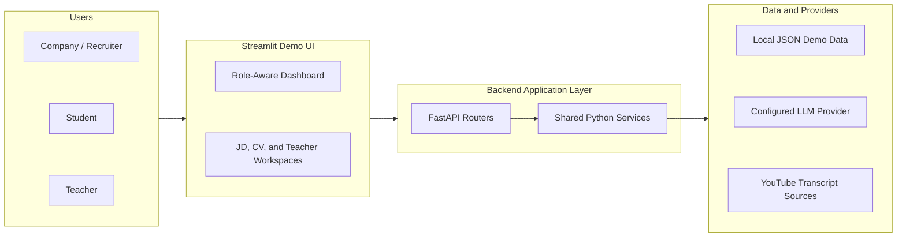
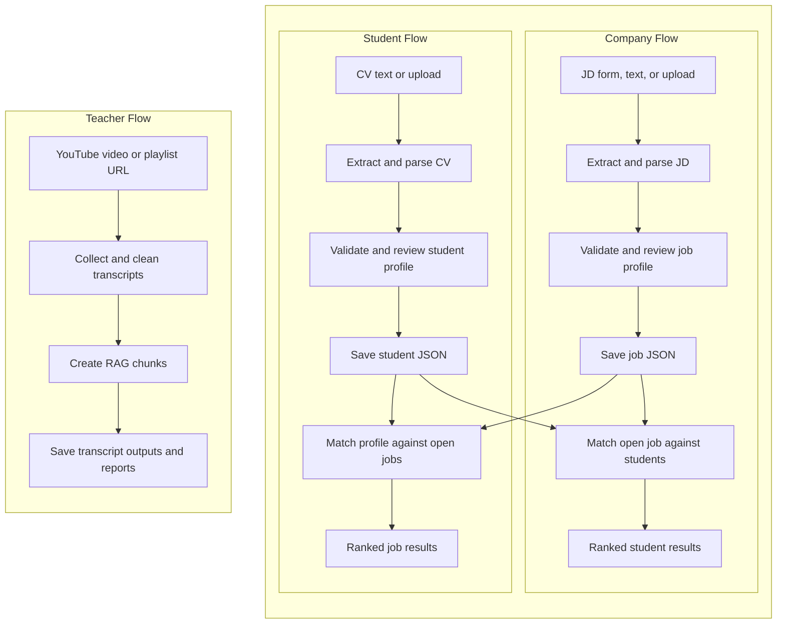

# Architecture

## Level

Level 3 - Demo Day.

This architecture favors clear module boundaries, demo-ready behavior, and simple local persistence over production infrastructure. Detailed endpoint lists live in `docs/RUNNING.md`; implementation history lives in `docs/IMPLEMENTATION_PLAN.md` and `docs/WORKLOG.md`.

## System Overview

At this level, the system is a local Streamlit demo backed by FastAPI routers and shared Python services. The same backend layer handles structured extraction, validation, matching, persistence, and transcript/RAG preparation; lower-level workflow ownership is described below.

## Module Boundaries

| Module | Owns | Notes |
|--------|------|-------|
| `jd_matching` | JD parsing, job lifecycle, enterprise-side `all_students_for_job` matching, and student-side open-job matching endpoints. | Despite the module name, this is the JD workflow router, not only a matching agent. Jobs must be open before matching. |
| `cv_analysis` | CV upload/text parsing into student skill profiles. | Student-facing extraction workflow. Saves validated profiles locally. |
| `student_profile` | Student profile CRUD, mock profile access, and summaries. | Keeps profile access separate from CV parsing. |
| Teacher RAG pipeline | YouTube transcript collection, cleaning, chunking, and reports. | Teacher-owned Streamlit/CLI workflow implemented as a shared service, separate from the FastAPI agent routers. |
| Shared services | Readers, LLM provider adapters, validation, storage, and matching logic. | Used by agents when behavior crosses module boundaries. |

The backend is intentionally agent-style: FastAPI workflows have routers under `backend/src/agents/`, while common schemas and utilities stay in `models/`, `services/`, `provider/`, and `core/`. The current FastAPI app includes `jd_matching`, `cv_analysis`, and `student_profile`; the teacher RAG path currently runs through the Streamlit page or CLI into `backend/src/services/youtube_rag_pipeline.py`.

## Core Data Flow

Company flow:

1. A company enters or uploads a JD in the JD Workspace.
2. The backend extracts text, parses it with the configured LLM or fallback parser, validates the result, and saves a job JSON file.
3. The company opens the job and runs matching.
4. The matching service ranks student profiles with deterministic rules. Demo seed profiles are stored in the same student store and marked with `metadata.is_mock = true`.

Student flow:

1. A student uploads or pastes CV content in the CV Analysis page.
2. The backend extracts skills with the configured LLM or fallback parser.
3. The validated profile is saved in the local student JSON store.
4. The student profile workflow can read, update, delete, or summarize saved profiles.

Teacher flow:

1. A teacher submits a YouTube video or playlist source.
2. The transcript pipeline writes raw transcripts, cleaned transcripts, RAG chunks, and run reports.
3. This data is stored separately from job and student matching data.

## Persistence

| Data | Location | Purpose |
|------|----------|---------|
| Jobs | `data/jobs` | Saved jobs and demo seed jobs. Mock rows are marked with `metadata.is_mock = true`. |
| Students | `data/students` | Saved CV-derived profiles and demo seed students. Mock rows are marked with `metadata.is_mock = true`. |
| YouTube RAG outputs | `data/youtube_rag` | Teacher transcript pipeline artifacts. |

Local JSON is a demo choice. It keeps the project easy to run and inspect, but it is not intended for concurrent production writes.

## Auth Boundary

Demo authorization is header-based:

- `enterprise`: JD parsing, job management, matching, and student list/review access.
- `student`: CV parsing and owned student profile management.
- `teacher`: transcript/RAG pipeline workflows.

This is only a role boundary for the demo. It should be replaced by real account/session auth before production use.

## AI Boundary

The LLM is used for structured extraction:

- JD text or form content to job requirement JSON.
- CV text to student skill profile JSON.

Matching is deterministic and explainable. If the LLM provider is not configured or fails, fallback parsers keep the demo usable.

## Integration Risks

- LLM outputs can be malformed, so validation and review remain required.
- Skill naming varies across JDs and CVs, so normalization should continue expanding.
- Mock profiles may differ from a future teammate-owned student API, so profile provider logic should stay isolated.
- Local JSON storage is simple but not production-safe under concurrent writes.
