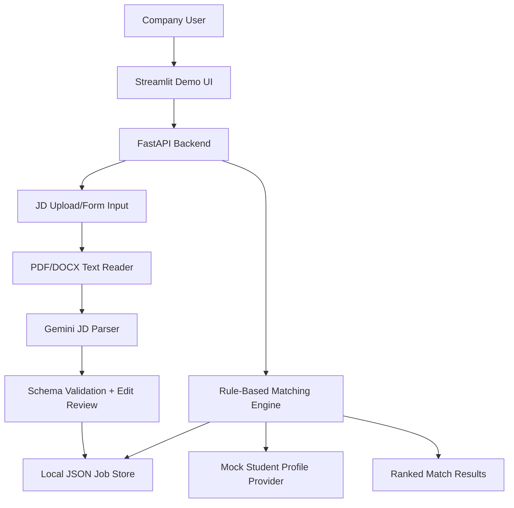

# Architecture

## Selected Level

Level 3 - Demo Day

## System Overview



## AI Core

The AI core is a JD parser. It extracts structured job requirements from uploaded or manually entered JD content. Matching decisions are not made by the LLM.

## Agent Type

Single-step extraction agent plus deterministic rule-based matching engine.

## State

| Field | Purpose |
|-------|---------|
| `raw_jd_text` | Text extracted from upload or assembled from form input. |
| `parsed_job_requirement` | Draft JSON returned by Gemini. |
| `validated_job_requirement` | Schema-valid JSON after validation and optional user edits. |
| `job_status` | Controls whether a job can be matched. |
| `match_thresholds` | Configurable thresholds for strong/partial/not match. |
| `student_profiles` | Mock or future API-provided student skill profiles. |

## Nodes Or Agents

| Name | Responsibility |
|------|----------------|
| JD text extractor | Read PDF/DOCX files into text. |
| JD parser | Use Gemini 3.1 Flash Lite to produce structured job requirement JSON. |
| Schema validator | Check required fields, data types, ranges, and missing skills. |
| Job manager | Create, view, update, open, close, and delete job requests. |
| Student profile provider | Return mock student profiles now and API profiles later. |
| Matching engine | Rank students for one open job using deterministic rules. |

## Tools

| Tool | Purpose | Source |
|------|---------|--------|
| Gemini 3.1 Flash Lite | JD extraction into JSON | Configured LLM provider |
| PDF reader | Extract text from uploaded PDF JDs | Python library |
| DOCX reader | Extract text from uploaded DOCX JDs | Python library |
| JSON schema / Pydantic | Validate parsed JD and API payloads | Python validation |
| FastAPI | Thin backend API | Local service |
| Streamlit | Simple demo UI | Local app |

## Core Schemas

### Student Skill Profile

```json
{
  "student_id": "student_001",
  "name": "Mock Student",
  "skills": {
    "Python": {
      "score": 8,
      "confidence": 0.85,
      "evidence": ["Flask API project", "pandas data analysis"]
    }
  }
}
```

### Job Requirement Profile

```json
{
  "job_id": "job_001",
  "company_id": "company_001",
  "title": "Backend Intern",
  "status": "open",
  "employment_type": "internship",
  "location": "Ho Chi Minh City",
  "salary_range": "3-5M VND",
  "benefits": ["Mentorship", "Flexible schedule"],
  "skills": {
    "Python": {
      "required_level": 7,
      "importance": 0.9,
      "required": true
    }
  }
}
```

## Matching Rules

Only jobs with `status = open` can be matched.

Default labels:

- `strong_match`: score `>= 0.80`
- `partial_match`: score `>= 0.60`
- `not_match`: score `< 0.60`

Score:

```text
weighted_score =
sum(min(user_score / required_level, 1) * importance) / sum(importance)
```

Constraint:

- If a student is missing a skill with `required = true` and `importance >= 0.8`, they cannot be labeled `strong_match`.

## Backend

Planned FastAPI endpoints:

- `POST /jobs/parse` - parse uploaded or text JD into draft JSON.
- `POST /jobs` - create a validated job request.
- `GET /jobs` - list job requests.
- `GET /jobs/{job_id}` - view one job request.
- `PATCH /jobs/{job_id}` - edit job request JSON or metadata.
- `POST /jobs/{job_id}/open` - mark job open.
- `POST /jobs/{job_id}/close` - mark job closed.
- `DELETE /jobs/{job_id}` - delete a job request.
- `GET /students/mock` - return mock student profiles for demo/integration testing.
- `POST /jobs/{job_id}/match` - run `all_students_for_job` matching.

## Frontend

Streamlit demo UI:

- Upload PDF/DOCX or enter JD through form.
- Display parsed JSON.
- Allow JSON review/edit before saving.
- Manage job status.
- Run matching and display ranked students.
- Adjust threshold settings for demo.

## Logging

Log:

- JD parse requests and validation failures.
- Job create/update/status/delete actions.
- Matching request, selected thresholds, and job status.
- Per-run match summary and errors.

## Risks

- Gemini output can be invalid; schema validation and edit review are required.
- Mock student profiles may not match future API shape exactly; use a provider interface.
- JSON local storage is demo-friendly but not production-safe under concurrent writes.
- Skill aliases can reduce match quality; add normalization for common variants.
